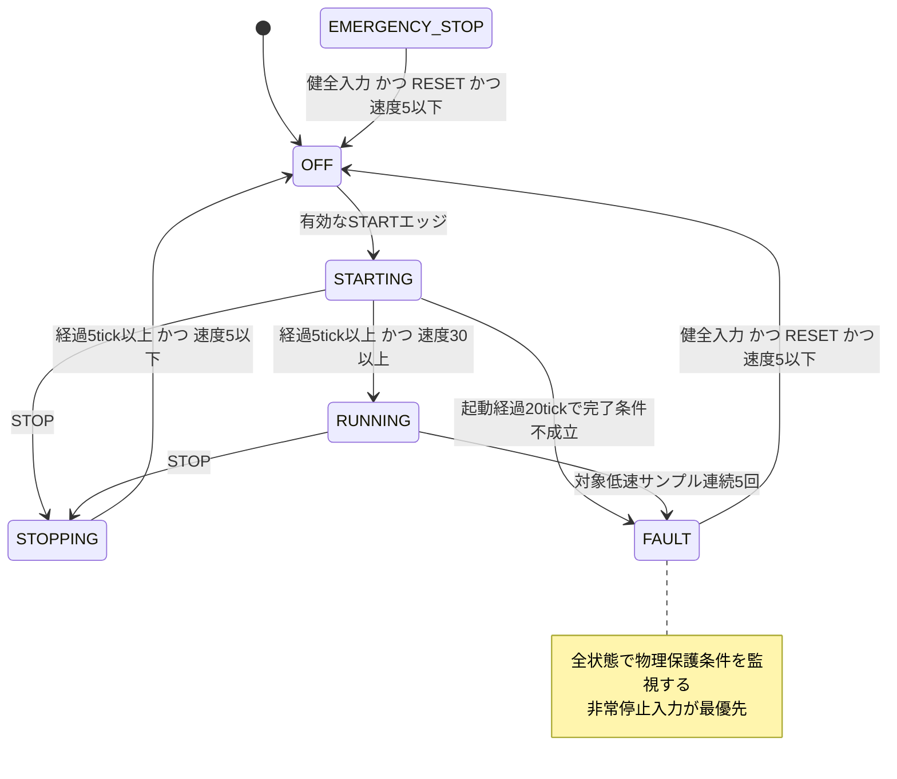

# 小型モータ制御ECU 要件仕様書

| 文書管理項目 | 内容 |
|---|---|
| 文書ID | SRS-MOTOR-ECU-001 |
| 版 | 0.1 |
| 作成日 | 2026-09-21 |
| 状態 | レビュー用初版。SILプロトタイプの暫定要件 |
| 対象 | Motor ECU Bug Hunterのモータ制御ソフトウェア |
| 用途 | 実装・テストの期待値の定義、および今後のJevによる仕様レビュー／実行トレース適合確認 |
| 関連資料 | [既存の簡易要求](../requirements.json)、[C実装](../controller.c)、[SIL実装](../simulation.py) |

## 1. 目的と適用範囲

本ソフトウェアは、始動・停止要求、非常停止、センサ情報および通信状態に基づき、小型モータのPWM指令とブレーキ指令を決定する。通常運転に加え、異常発生時の出力遮断、再始動の抑止、故障解除を扱う。

本書は、10 ms周期で実行するSIL向け制御ソフトウェアの要求を定義する。しきい値は既存プロトタイプで採用している暫定値であり、特定の実モータに適した定格・保護値として承認したものではない。

対象には、状態遷移、入力の優先順位、出力、保護動作、時間条件、数値境界、および判定に必要な観測情報を含む。モータの回路設計、電力段の故障対策、実ブレーキの制動力、実時間スケジューリング、ハードウェアwatchdogの復帰処理は、別途要件化する。

本書では、次を区別する。

- **要件**：第2～8章のうち、`MEC-`で始まるIDを付けた規範的な要求。用語、パラメータ、優先順位表を併せて解釈する。
- **暫定決定**：第9章の`DEC-`項目。初版を一意に判定可能にするための設計上の選択。
- **未決事項**：第10章の`TBD-`項目。未決事項だけを根拠に、実装が適合／違反していると断定しない。
- **受入例**：第11章。期待値を示すテスト設計であり、すべてを実行済みとする記録ではない。

本書の記述品質は、専用の要件レビュー機能から要件ID単位でJevに判定させられる。自由入力、一文のみ／文脈付き、8観点の独立判定を用意する。操作方法は[READMEの要件レビュー](../README.md#要件仕様書をjevでチェック)を参照する。SILトレースの適合確認は引き続き既存の`requirements.json`を読み込んでおり、本書の作成・レビューによって、制御コードや保存済み評価結果が変更されるものではない。

## 2. 用語、時刻および判定の前提

### 2.1 周期の定義

`k`を論理周期の順序とする。`I[k]`は周期開始時に取り込んだ入力一式、`S[k]`と`PWM[k]`は、その入力を処理し終えた周期終了時の状態とPWMである。したがって、周期開始時の制御状態は`S[k-1]`となる。

「同一周期でPWMを0にする」とは、`I[k]`で条件を検出したとき、`PWM[k] = 0`が成立することをいう。次の周期の終了まで残留出力を許容する意味ではない。ただし周期終了時だけのログでは、周期途中の短いパルスや実時間の応答遅延は判定できない。

状態への遷移を受理した周期の経過時間は0とする。例えば周期100でSTARTINGに入った場合、周期104は4 tick、周期105は5 tick経過である。1 tickは10 msであり、5 tickは50 ms、20 tickは200 msに相当する。

### 2.2 入力と出力を混同しないための定義

- **正常な制御動作**：本書の要求を満たす動作。入力に異常があり、適切にFAULTへ遷移する動作も含む。
- **制御ソフトウェアの不具合**：本書の適用可能な要件に反する状態・出力・遷移。
- **FAULT状態**：異常検出に伴う保護状態。状態名だけを根拠にソフトウェア不具合と判定しない。
- **駆動禁止ラッチ**：FAULTまたはEMERGENCY_STOPへ入った後、解除条件を満たすまで駆動を禁止する記憶状態。本書では単に「ラッチ」とも表記する。
- **静止判定**：`motor_speed <= 5`。実機の完全な静止を証明する意味ではなく、このSILの閾値判定。
- **始動エッジ**：`start_switch[k-1] = 0`かつ`start_switch[k] = 1`。電源投入前の前回値は0とする。
- **健全入力**：非常停止が解除され、センサ有効、通信正常、電流・温度・リミット・比較可能なエンコーダ差分に保護条件がない入力。

### 2.3 要件の重要度と確認方法

| 表記 | 意味 |
|---|---|
| SC | 保護機能や意図しない通電に関係する要求。実験内の重要度分類であり、規格上の安全水準ではない |
| F | 始動・停止・復帰などの機能成立に関係する要求 |
| M | 観測、診断、評価の再現性に関係する要求 |
| D | 入力・出力または有限の履歴から決定的に確認できる |
| R | コード・設計・計測方式のレビューが必要。周期終了ログだけでは十分でない |

各要求表の「確認」は、確認方法と重要度を`D / SC`のように表す。Jevの判定結果を、そのまま安全性の証明として扱わない。

## 3. インターフェース

### 3.1 制御入力

すべての入力は、その周期のスナップショットとして扱う。boolは0または1で表す。

| 名称 | 型・単位 | 意味・入力契約 |
|---|---|---|
| `start_switch` | bool | 始動要求。0→1のエッジを受理する |
| `stop_switch` | bool | 通常停止要求。1のレベルを評価する |
| `emergency_stop` | bool | 非常停止要求。1のレベルを評価する |
| `motor_current` | 非負整数、0.1 A | 電流の大きさ。120は12.0 A。256以上も比較前に狭い整数型へ切り詰めない |
| `motor_speed` | 非負整数、正規化速度単位 | 速度の大きさ。rpmとの換算は未定義。逆回転の符号は表さない |
| `encoder_position` | 16 bit符号なし整数、count | 0～65535の循環位置。隣接サンプル間の差分を使用する |
| `limit_switch` | bool | 1でリミット到達を表す。本版は方向を持たず、両方向の駆動を禁止する |
| `temperature` | 整数、℃ | モータまたは保護対象の温度。実センサの配置は未決 |
| `communication_alive` | bool | 0で通信喪失が判定済みであることを表す。通信喪失を判定するタイムアウト自体は上流の責務 |
| `reset_fault` | bool | 故障解除要求。初版では1のレベルを評価する |
| `sensor_valid` | bool | 電流・速度・温度・エンコーダを含む当該入力フレームの有効性。0の場合、数値を正常な測定値として使用しない |
| `target_pwm` | 符号付き整数、% | 目標PWM。範囲外の値も受け入れ、使用時に0～100へ飽和させる |

SILの数値入力は32 bit整数で表現可能であることを前提とする。`target_pwm`以外の範囲外、負の速度・電流、欠測、非数値は、入力生成側で無効フレームとして識別する。実機での許容範囲と識別方法は`TBD-02`で定める。

`motor_speed`とエンコーダ差分は別の観測量である。本版には両者の校正関係、許容誤差、フィルタ遅延がないため、単純な数値不一致を仕様違反としない。

### 3.2 出力と観測項目

| 名称 | 型・単位 | 観測上の意味 |
|---|---|---|
| `state` | 列挙値 | 周期終了時の制御状態 |
| `pwm` | 整数、% | 周期終了時に確定したPWM指令。基本範囲0～100 |
| `brake` | bool | 1でブレーキ要求、0で解除要求。実際の制動力とは区別する |
| `cycle` | 32 bit符号なし整数、tick | 周期ラベル。wrapするため、ログの並び順も保持する |
| `estimated_speed` | 符号付き整数、count/tick | 名称によらず、エンコーダの符号付き差分。`motor_speed`と同じ単位ではない |
| `start_elapsed` | 整数、tick | STARTING中の経過時間。状態外では診断上の補助情報 |
| `stop_elapsed` | 整数、tick | STOPPING中の経過時間。状態外では診断上の補助情報 |
| `stall_count` | 整数、sample | RUNNINGで連続する低速サンプル数 |
| `start_count` | 32 bit符号なし整数、回 | 受理した始動要求数。運転の可否を制限する値ではない |
| `fault_code` | 整数 | 原因を補助的に示す診断コード。保持・上書き・同時故障の方針は`TBD-05` |

`fault_code`が0でもEMERGENCY_STOPは成立し得る。数値コードだけでラッチ解除や保護動作の適否を決めない。

### 3.3 SIL専用の条件

`watchdog_due`と`isr_window`は、処理順序や入力の参照タイミングを調べるための試験用条件であり、運転指令ではない。これらが変化しても本書の保護応答は遅延してはならない。

通常の初期値は`cycle=0`、`start_count=0`とする。境界試験では事前条件として別の初期値を指定できる。この設定は、他の状態・出力・始動履歴を初期化する要求を変更しない。

## 4. パラメータと優先順位

### 4.1 暫定パラメータ

| パラメータ | 値 | 境界の扱い |
|---|---:|---|
| 制御周期 | 10 ms | SILの論理周期 |
| 過電流閾値 | 120（12.0 A） | **120以上**で異常 |
| 過温度閾値 | 90℃ | **90以上**で異常 |
| 起動最短時間 | 5 tick | **5以上**で時間条件成立 |
| 起動完了速度 | 30 | **30以上**で速度条件成立 |
| 起動期限 | 20 tick | 20で完了条件不成立ならタイムアウト |
| 停止最短時間 | 5 tick | **5以上**で時間条件成立 |
| 停止完了・解除許可速度 | 5 | **5以下**で成立 |
| 失速判定速度 | 5 | **5未満**を低速サンプルとする |
| 失速確定数 | 5 sample | 対象となる低速サンプルが**連続5回** |
| エンコーダ最大正常差分 | 500 count/tick | 絶対値が**500超**で異常。±500は正常範囲 |
| PWM範囲 | 0～100% | 両端を含む |
| 通常PWM変化上限 | 10 percentage points/tick | 上昇・下降とも10ポイント。保護・停止時の即時0を除く |

### 4.2 同一周期で競合する要求の優先順位

上から先に適用する。上位の処理が成立した周期に、下位処理を続けて始動させてはならない。

| 順位 | 条件 | 主な結果 |
|---:|---|---|
| 1 | `emergency_stop=1` | EMERGENCY_STOP、PWM=0、brake=1 |
| 2 | センサ無効、通信喪失、過電流、過温度、リミット、比較可能なエンコーダ差分異常のいずれか | FAULT、PWM=0、brake=1 |
| 3 | 周期開始時点でラッチ中 | 解除条件を評価する。成立時はOFFへ。成立しなければ駆動禁止を維持 |
| 4 | 周期開始時点でSTARTINGまたはRUNNING、かつSTOP=1 | STOPPING、PWM=0、brake=1 |
| 5 | 通常の状態遷移 | OFFの始動判定、STARTINGの完了／期限判定、RUNNINGの失速判定、STOPPINGの完了判定 |

OFFでSTOPとSTARTが同時に1となった場合はOFFを維持する。STOPPING中のSTOP継続は停止タイマを再開始しない。STARTINGで完了条件と起動期限が同時に成立した場合は、完了条件を優先する。

## 5. 状態モデル



図は通常遷移の概要であり、全状態共通の保護遷移は次の表を適用する。

| 周期開始状態 | 最優先の成立条件 | 周期終了状態 | PWM / brake |
|---|---|---|---|
| 任意 | E-STOP=1 | EMERGENCY_STOP | 0 / 1 |
| 任意 | E-STOP=0かつ物理保護条件成立 | FAULT | 0 / 1 |
| FAULTまたはEMERGENCY_STOP | 健全入力かつRESET=1かつ速度≤5 | OFF | 0 / 0 |
| FAULTまたはEMERGENCY_STOP | 解除条件不成立、かつ上位保護条件なし | 開始時の状態を維持 | 0 / 1 |
| OFF | 健全入力かつSTOP=0かつSTARTエッジ | STARTING | 通常PWM更新 / 0 |
| OFF | その他、かつ上位保護条件なし | OFF | 0 / 0 |
| STARTINGまたはRUNNING | STOP=1、かつ上位保護条件なし | STOPPING | 0 / 1 |
| STARTING | 完了条件成立 | RUNNING | 通常PWM更新 / 0 |
| STARTING | 完了条件不成立かつ経過≥20 | FAULT | 0 / 1 |
| STARTING | 上記以外 | STARTING | 通常PWM更新 / 0 |
| RUNNING | 対象低速サンプルが連続5回 | FAULT | 0 / 1 |
| RUNNING | 上記以外 | RUNNING | 通常PWM更新 / 0 |
| STOPPING | 経過≥5かつ速度≤5、かつ上位保護条件なし | OFF | 0 / 0 |
| STOPPING | その他、かつ上位保護条件なし | STOPPING | 0 / 1 |

表は第4.2節の優先順位に従う。例えばSTARTINGの完了条件が成立していても、同じ周期にSTOPがあればSTOPPINGとなる。

## 6. 機能要件

### 6.1 周期と初期化

| ID | 要求 | 必要な観測・境界 | 確認 |
|---|---|---|---|
| MEC-TIM-001 | 各SILステップを10 ms相当の1論理周期として処理すること | 入力周期、ログ順序、cycle。実時間の処理所要時間は別評価 | D / F |
| MEC-TIM-002 | 当該周期で取り込んだ一貫した入力スナップショットを使い、状態と出力をその周期の終了時に確定すること | 同周期の入力と出力の対応。実機での一貫した取り込みはRで確認 | D・R / SC |
| MEC-INI-001 | 初期制御状態をOFF、PWM=0、brake=0、失速カウンタ=0、駆動禁止フラグ解除、前回START=0とすること | 第1周期直前の初期条件。境界試験のcycle/start_count指定は許可 | D・R / SC |
| MEC-INI-002 | 初回周期にSTARTがなく、上位保護条件もない場合、OFF/PWM=0/brake=0を出力すること | 起動直後だけの不要PWMを許容しない | D / SC |
| MEC-INI-003 | 初回周期のSTART=1は前回START=0からの始動エッジとして扱うこと | 健全入力かつSTOP=0の場合。製品化時の扱いはDEC-01 | D / F |

### 6.2 保護動作

以下の「保護状態」はFAULT/PWM=0/brake=1を意味する。E-STOPが同時に有効な場合はEMERGENCY_STOP/PWM=0/brake=1を優先する。

| ID | 要求 | 必要な観測・境界 | 確認 |
|---|---|---|---|
| MEC-SAF-001 | E-STOP=1を取り込んだ周期に、開始状態に関係なくEMERGENCY_STOP/PWM=0/brake=1へ移行すること | E-STOPの立上り周期を含む。RESETと同時でも解除不可 | D / SC |
| MEC-SAF-002 | sensor_valid=0を取り込んだ周期に保護状態へ移行すること | 前周期の有効値に置換して運転を継続しない | D / SC |
| MEC-SAF-003 | communication_alive=0を取り込んだ周期に保護状態へ移行すること | 通信断の最初の周期も残留PWMを許容しない | D / SC |
| MEC-SAF-004 | motor_current≥120を取り込んだ周期に保護状態へ移行すること | 119はこの条件で異常にしない。120、121、256は成立 | D / SC |
| MEC-SAF-005 | temperature≥90を取り込んだ周期に保護状態へ移行すること | 89はこの条件で異常にしない。90、91は成立 | D / SC |
| MEC-SAF-006 | limit_switch=1を取り込んだ周期に保護状態へ移行すること | RUNNINGを含む全状態に適用する | D / SC |
| MEC-SAF-007 | 比較可能な隣接エンコーダの正規化差分の絶対値が500を超えた周期に保護状態へ移行すること | ±500はこの条件では異常でない。±501は異常。無効フレームを跨ぐ場合はTBD-04 | D / SC |
| MEC-SAF-008 | watchdog処理予定やISR試験条件を理由として、MEC-SAF-001～007の状態・出力確定を次周期へ遅らせないこと | 同じ制御入力に対しwatchdog_due/isr_windowの有無を変えて比較する | D・R / SC |

### 6.3 ラッチと故障解除

| ID | 要求 | 必要な観測・境界 | 確認 |
|---|---|---|---|
| MEC-LAT-001 | FAULTまたはEMERGENCY_STOPに入った後、解除成立までPWM=0を維持し、始動を受理しないこと | 通信回復、電流低下、E-STOP解除だけでは始動不可 | D / SC |
| MEC-LAT-002 | 周期開始時点でラッチ中の場合、健全入力かつreset_fault=1かつmotor_speed≤5の全条件が成立したときだけ解除すること | 速度5は可、6は不可。新たな保護条件が同周期にあれば解除不可 | D / SC |
| MEC-LAT-003 | 解除成立周期はOFF/PWM=0/brake=0とし、駆動禁止フラグと失速カウンタを解除・初期化すること | 同周期にSTARTを受理しない。後続の新しいSTARTは受理可能 | D・R / F |
| MEC-LAT-004 | reset_faultを1に保持している場合も、初めて解除の全条件が成立した周期に解除すること | 初版のRESETはレベル判定。新たな立上りを必須としない（DEC-02） | D / F |
| MEC-LAT-005 | ラッチ中の状態表示は第4.2節に従い、E-STOP有効時はEMERGENCY_STOP、E-STOP解除後に物理保護条件があればFAULTとすること | 状態表示の切替でラッチやPWM=0を解除しない（DEC-03） | D / SC |

### 6.4 始動

| ID | 要求 | 必要な観測・境界 | 確認 |
|---|---|---|---|
| MEC-STA-001 | 周期開始時点がOFFで、健全入力かつSTOP=0かつ新しいSTARTエッジがある場合、その周期にSTARTINGへ遷移すること | STOP=1と同時ならOFFを維持。条件成立時の始動取りこぼしは不可 | D / F |
| MEC-STA-002 | STARTの前回値をすべての状態で追跡し、OFF以外で発生したエッジを将来の始動要求として予約しないこと | STOPPING完了周期・故障解除周期のSTARTも予約しない。保持された1は再始動エッジでない | D・R / SC |
| MEC-STA-003 | STARTINGへの進入ごとに起動経過時間を0、失速カウンタを0、brakeを0にすること | 過去の始動・停止・故障の内部状態を引き継いで始動を妨げない | D・R / F |
| MEC-STA-004 | STARTINGでは、起動経過≥5 tickかつmotor_speed≥30の両方が成立した周期にRUNNINGへ遷移すること | OR判定をしない。上位のSTOP・保護処理が成立した周期を除く | D / F |
| MEC-STA-005 | STARTINGで完了条件を満たさない場合、起動経過が20 tickとなった周期にFAULT/PWM=0/brake=1へ移行すること | 19では期限を理由に停止しない。20から21への猶予を設けない | D / F |
| MEC-STA-006 | 起動経過20 tickで速度条件も成立した場合、RUNNINGへ遷移すること | 完了判定を期限判定より優先する（DEC-04） | D / F |

### 6.5 通常停止

| ID | 要求 | 必要な観測・境界 | 確認 |
|---|---|---|---|
| MEC-STP-001 | 周期開始時点がSTARTINGまたはRUNNINGでSTOP=1の場合、上位保護条件がなければ同周期にSTOPPING/PWM=0/brake=1へ移行すること | START、起動完了、起動期限、失速条件よりSTOPを優先する | D / SC |
| MEC-STP-002 | STOPPING進入時に停止経過時間を0へ初期化し、進入後のSTOP継続では再初期化しないこと | 2回目以降の停止にも適用。前回停止時刻の再利用不可 | D / F |
| MEC-STP-003 | STOPPINGでは停止経過≥5 tickかつmotor_speed≤5が成立するまでSTOPPING/PWM=0/brake=1を維持すること | 4 tick・速度0でも未完了。5 tick・速度6でも未完了 | D / SC |
| MEC-STP-004 | STOPPING中はSTARTを受理せず、停止完了周期にSTARTINGやRUNNINGへ直接遷移しないこと | 高速STOP→STARTやSTART保持時も同じ | D / SC |
| MEC-STP-005 | 停止完了条件が成立した周期にOFF/PWM=0/brake=0へ遷移すること | PWMの再出力やブレーキの解除漏れを許容しない | D / F |

STOPPINGに最大継続時間は定義しない。速度が5を超える間の停止待ちだけを理由に、初版への違反とはしない。製品向けの停止タイムアウトは`TBD-06`で決める。

本版の経過時間の確認範囲は、1回のSTOPPINGが2^32 tick未満の場合とする。それ以上継続した場合の経過時間表現と完了判定は`TBD-06`に含める。この範囲外でも、STOPPING中のPWM=0、brake=1、START受理禁止の要求は引き続き適用する。

### 6.6 運転中の失速

| ID | 要求 | 必要な観測・境界 | 確認 |
|---|---|---|---|
| MEC-RUN-001 | 周期開始時点がRUNNINGで、上位の保護・STOP処理が成立しない周期だけを失速判定の対象サンプルとすること | STARTING→RUNNINGになった周期は数えない。周期終了stateだけで対象を決めない | D / F |
| MEC-RUN-002 | 対象サンプルでmotor_speed<5なら連続カウントを1増やし、5以上なら0へ戻すこと | 速度5は低速でない。低速2回→回復→低速3回は5連続でない | D / F |
| MEC-RUN-003 | 対象低速サンプルが連続5回となった周期にFAULT/PWM=0/brake=1へ移行すること | 4回では失速を理由に停止しない。STOPPING等へ退出後は新しい始動時に数え直す | D / F |

### 6.7 PWMとブレーキ

目標値を`T[k] = min(100, max(0, target_pwm[k]))`とする。通常PWM更新は、前周期のPWMからTへ向けて最大10ポイントだけ移動する処理である。

```text
T >= PWM[k-1] の場合: PWM[k] = min(T, PWM[k-1] + 10)
T <  PWM[k-1] の場合: PWM[k] = max(T, PWM[k-1] - 10)
```

| ID | 要求 | 必要な観測・境界 | 確認 |
|---|---|---|---|
| MEC-PWM-001 | PWM出力を常に0～100の範囲に保ち、target_pwmを上記Tへ飽和させてから使用すること | 目標-1は0、目標140は100。上昇時の範囲逸脱、下降時のunsigned underflowは不可 | D / SC |
| MEC-PWM-002 | 周期終了状態がSTARTINGまたはRUNNINGで上位停止処理がない場合、上記の通常PWM更新を同周期に1回行うこと | STARTINGへの進入周期にも適用。目標一定なら到達後はその値を保つ | D / F |
| MEC-PWM-003 | 周期終了状態がOFF、STOPPING、FAULT、EMERGENCY_STOPの場合はPWM=0とすること | 起動直後・状態切替時の1周期だけの残留や再出力も不可 | D / SC |
| MEC-PWM-004 | STOPまたは保護処理で0へ移行するときは、通常PWMの変化量制限に優先して同周期に0とすること | 例：PWM72→0の減少をslew違反と判定しない | D / SC |
| MEC-PWM-005 | OFF、STARTING、RUNNINGではbrake=0、STOPPING、FAULT、EMERGENCY_STOPではbrake=1とすること | すべて周期終了時の値。実モータ停止の所要時間は保証しない | D / F |

### 6.8 数値処理と入力の参照

| ID | 要求 | 必要な観測・境界 | 確認 |
|---|---|---|---|
| MEC-ENC-001 | 比較可能なエンコーダ差分を16 bit循環数として計算し、[-32768,32767]へ正規化すること | 65535→0は+1、0→65535は-1、65530→10は+16。通常wrap自体は故障でない | D / F |
| MEC-ENC-002 | 初回の有効エンコーダ値を差分計算の基準にし、初回差分は0とすること | 電源投入後最初のフレームが有効な場合に適用。無効フレームからの再開はTBD-04 | D / F |
| MEC-NUM-001 | 起動・停止経過時間は32 bit周期値のmodulo差で計算し、16 bit境界や32 bit wrapだけで早期完了・早期タイムアウトしないこと | 1つの計測区間は2^32 tick未満を前提。65535→65536と2^32−1→0を区別して確認 | D・R / F |
| MEC-NUM-002 | 始動要求の受理回数を理由に有効な始動を拒否せず、1000回目を含め同じ受理条件を適用すること | 通常始動でstart_countを1増やす。32 bitの回数wrapも始動可否に影響させない | D / F |
| MEC-DAT-001 | センサ・通信・非常停止の判定には当該周期の入力値を使い、過去の正常値で保護条件を無効化しないこと | 最新入力と実際に使った値の対応。実際のISR共有・最適化の確認にはRが必要 | D・R / SC |
| MEC-DAT-002 | 型変換による桁落ち・符号変化で、入力契約内の値に対する保護判定とPWM計算を変えないこと | 例：current=256を0へ、PWM=5からの減算を251へ変えない | D・R / SC |

エンコーダ正規化は次の式と等価な結果とする。ここでmodは非負の剰余を返す数学上の演算であり、特定言語の負数剰余の挙動に依存しない。

```text
delta[k] = ((encoder[k] - encoder[k-1] + 32768) mod 65536) - 32768
```

## 7. 観測と適合判定の要件

以下は制御ソフトウェアを評価するハーネス側の要件である。制御ソフトウェア自身の不具合と、観測の不足を区別する。

| ID | 要求 | 必要な観測・境界 | 確認 |
|---|---|---|---|
| MEC-OBS-001 | トレースに入力スナップショットと処理後のstate/pwm/brake/cycleを対応付けて記録すること | 入力が処理前か後か不明なログは同周期応答を判定できない | D / M |
| MEC-OBS-002 | トレースの順序、周期欠落、初期条件、およびウィンドウ開始前の必要な履歴を識別できるようにすること | タイマ開始、START前値、ラッチ状態、失速の連続数が不明な窓は該当要件を保留 | D / M |
| MEC-OBS-003 | 適合確認の出力に要件ID、評価結果、根拠となる周期・入力・出力を記録すること | 要件に結び付かない印象だけを「違反確定」としない | D / M |
| MEC-OBS-004 | 保護状態、機械的な惰性回転、正常なwrap、範囲外目標の正しい飽和処理を、それだけで不具合と判定しないこと | FAULTという文字やPWM=0時の速度>0だけでは違反証拠にならない | D / M |
| MEC-OBS-005 | 判定対象の要件に必要な証拠が不足する場合、適合・違反のどちらにも置き換えず判定不能を記録すること | 途中PWM、実ISR競合、通信の上流timeout、未知の初期履歴など | D / M |

要件単位の適合判定は次の4値を想定する。これは今後のチェック機構の出力契約案であり、既存のQ1を実装変更したものではない。

| 判定 | 使用条件 |
|---|---|
| PASS | 要件が適用され、必要な証拠が揃い、観測範囲内で要求を満たす |
| FAIL | 要件が適用され、具体的な要求違反の証拠がある |
| NOT_APPLICABLE | 評価区間では要件の前提・発火条件が成立しないことを確認できる |
| INCONCLUSIVE | 前提、履歴、観測項目、または未決仕様が不足し、合否を決められない |

PASSは観測した範囲に対する結果であり、未知の入力列や実機を含む全動作の正しさを示さない。たとえばE-STOP入力のない窓を、非常停止機能の確認済みケースとして数えない。

## 8. 非機能要件と検証上の制約

| ID | 要求 | 必要な観測・境界 | 確認 |
|---|---|---|---|
| MEC-NFR-001 | 同じ要件版・実装・初期条件・入力列に対するSIL状態・出力を再現可能とすること | プラントに乱数を使う場合はseedも記録する。外部AI応答の再現性とは別 | D / M |
| MEC-NFR-002 | 入力取り込み方式、ISR/main間の共有、出力確定順序について、保護要求が成立する設計根拠を示せること | 古い値を使う模擬モデルの再現を、実競合・volatileの十分な検証としない | R / SC |
| MEC-NFR-003 | 要件適合の評価時、バグID・変異名・正解ラベル・正常版との比較結果を、Jevに渡す観測入力へ含めないこと | 正解や原因の情報漏れによる成績の過大評価を防ぐ | D / M |

実時間10 ms以内での処理完了、非同期E-STOPの検出から電力遮断までの時間、停止距離、機械的な保持力、ハードウェアwatchdogの期限については、本版では数値要求を定めない。SILの「同一周期」をこれらの実機保証へ読み替えない。

## 9. 初版で採用する暫定決定

次の項目は既存SILの意図を踏まえ、判定の曖昧さを解消するために初版で採用した。実製品の要求として確定したものではない。

| ID | 暫定決定 | 関連要件 |
|---|---|---|
| DEC-01 | 初期START前値は0。初回のSTART=1は有効エッジとする | MEC-INI-003、MEC-STA-001 |
| DEC-02 | RESETはレベル判定。押し続けている間に健全復帰・静止条件が成立した場合も解除する | MEC-LAT-002～004 |
| DEC-03 | ラッチとは駆動禁止の保持を指す。E-STOPが解除されても物理故障があれば、RESETなしで状態表示をFAULTへ変更できる | MEC-LAT-001、005 |
| DEC-04 | 起動期限20 tickで完了条件も成立した場合は起動成功とする | MEC-STA-005、006 |
| DEC-05 | 電流・温度・通信喪失・リミット・無効フレーム・比較可能なエンコーダ差分異常の保護は1サンプルで成立し、デバウンス・ヒステリシスを設けない | MEC-SAF-002～007 |
| DEC-06 | STOPPINGには最大時間を設けず、停止完了までSTARTを受理しない | MEC-STP-003、004 |
| DEC-07 | 失速は周期開始状態がRUNNINGのサンプルで数える。RUNNINGへ遷移した周期は含めない | MEC-RUN-001～003 |

## 10. 未決事項

未決事項は「正常とみなす条件」ではない。該当する要求を追加・改版するまで、その観点の適合性は判断できない。

| ID | 未決定の内容 | 決定に必要な情報 |
|---|---|---|
| TBD-01 | 実モータの定格、過電流・過温度閾値、速度単位、加減速指令、回転方向 | 対象モータ、電力段、負荷、使用条件 |
| TBD-02 | センサの物理許容範囲、欠測・断線検出、入力型の境界、valid生成条件 | センサ仕様、入力ドライバ、フィルタ仕様 |
| TBD-03 | communication_aliveの生成条件、通信timeout、復帰認定、チャタリング対策 | 通信周期、許容連続欠落数、ネットワーク条件 |
| TBD-04 | 無効フレームを跨ぐエンコーダ基準の保持／再初期化、復帰直後の差分有効性 | 欠測時の位置保証、復帰手順。現実装は無効周期でも基準を更新する |
| TBD-05 | fault_codeの定義、最初／最新原因の保持、同時故障の優先順位、E-STOP用コード | 診断・保守要件。現実装の数値や上書き順を規範にしない |
| TBD-06 | 停止最大時間、停止失敗の通知、長時間STOPPINGの扱い、2^32 tick以上の経過時間表現と完了判定 | 慣性、負荷、ブレーキ性能、許容停止距離、計測の最大継続時間 |
| TBD-07 | 実時間の応答期限、周期ジッタ、入力取り込み時刻、ISR同期、watchdog期限・復帰 | 実行MCU、OS、割り込み・タスク設計、計測環境 |
| TBD-08 | 実ブレーキの指令極性、電源断時の挙動、電力段故障への対処 | 回路・機構・電源の設計条件 |
| TBD-09 | 製品での初期START、RESETの操作条件、手動再始動の要求 | 操作系と運用手順。DEC-01～03の採否 |
| TBD-10 | 実機評価の合否基準と必要な安全保証 | 製品用途、リスク評価、要求される検証・審査の範囲 |

## 11. 受入テストの設計例

表の期待値は本書に基づく。記載のない保護入力は健全、エンコーダは正常、観測履歴は既知とする。これらは仕様から導いた受入例であり、既存の30変異ケースによる実施状況や網羅性を表していない。

特記しない通常操作入力は`start_switch=0`、`stop_switch=0`、`reset_fault=0`とする。「起動受理k」などの事前条件を成立させる準備操作は、各行で指定した条件を優先する。

| テストID | 入力・事前条件 | 期待結果 | 関連要件 |
|---|---|---|---|
| AT-001 | 初期OFF、START=0 | 初回出力OFF/PWM=0/brake=0 | MEC-INI-001、002 |
| AT-002 | 初期OFF、START=1、STOP=0、target=60 | 初回出力STARTING/PWM=10/brake=0、起動経過0 | MEC-INI-003、MEC-STA-001、003、MEC-PWM-002 |
| AT-003 | RUNNING/PWM72でE-STOPを0→1 | 同周期EMERGENCY_STOP/PWM0/brake1。速度が残っても可 | MEC-SAF-001、MEC-PWM-004、MEC-OBS-004 |
| AT-004 | 電流を119、120、121、256へ変える独立試験 | 119は電流保護を発火させず、他3値は同周期FAULT/PWM0 | MEC-SAF-004、MEC-DAT-002 |
| AT-005 | 温度89、90、91の独立試験 | 89は温度保護を発火させず、90・91で同周期FAULT | MEC-SAF-005 |
| AT-006 | sensor_valid=0、または通信alive=0、またはlimit=1 | 各条件の最初の周期でFAULT/PWM0 | MEC-SAF-002、003、006 |
| AT-007 | 正常隣接encoderが65535→0、0→65535 | 差分+1、-1。wrapを理由にFAULTへ入らない | MEC-ENC-001 |
| AT-008 | 比較可能なencoder差分が+500、-500、+501、-501 | ±500は許容、±501はFAULT | MEC-SAF-007 |
| AT-009 | 起動受理k、速度30以上、k+4→k+5 | k+4ではSTARTING、k+5でRUNNING | MEC-STA-004 |
| AT-010 | 起動受理k、速度29以下のままk+19→k+20 | k+19ではSTARTING、k+20でFAULT | MEC-STA-005 |
| AT-011 | 起動受理k、k+19まで速度29、k+20で30 | k+20でRUNNING | MEC-STA-006 |
| AT-012 | STARTING中、同周期に起動完了条件とSTOP=1 | STOPPING/PWM0/brake1。過去の開始時刻によらず停止経過0 | MEC-STP-001、002 |
| AT-013 | STOPPING進入k、速度0、k+4→k+5 | k+4ではSTOPPING、k+5でOFF/brake0 | MEC-STP-003、005 |
| AT-014 | STOPPING進入後5 tick以上、速度6→5 | 速度6ではSTOPPING、5の周期でOFF | MEC-STP-003、005 |
| AT-015 | STOPPING中および完了周期にSTARTエッジ、その後START保持 | 停止完了まで駆動せず、完了後も予約始動しない。OFFで再度0→1なら始動 | MEC-STA-002、MEC-STP-004 |
| AT-016 | 初期stall_count=0、RUNNINGの対象サンプルで速度4が4回→5回 | 4回目は失速FAULTなし、5回目でFAULT | MEC-RUN-001、003 |
| AT-017 | 初期stall_count=0、RUNNING対象サンプルの速度が4,4,5,4,4,4 | 回復値5でカウントを0に戻し、最後のカウントは3。失速FAULTなし | MEC-RUN-002 |
| AT-018 | 通信FAULT後に通信だけ復旧、RESET=0 | FAULT/PWM0を維持。自動始動しない | MEC-LAT-001 |
| AT-019 | FAULTでRESET=1を保持、健全復帰時の速度6→5 | 速度6では解除せず、5の周期にOFFへ解除 | MEC-LAT-002～004 |
| AT-020 | E-STOP=1とRESET=1が同時、速度0 | EMERGENCY_STOPを維持 | MEC-SAF-001、MEC-LAT-002 |
| AT-021 | E-STOPラッチ後、E-STOP解除・通信alive=0・RESET=0 | FAULTへ状態表示が変わってもPWM0/brake1とラッチを維持 | MEC-LAT-005 |
| AT-022 | ラッチ解除時にSTARTを1へ上げ、そのまま保持 | 解除周期はOFF、次周期もOFF。後で新たなエッジを与えると始動可 | MEC-STA-002、MEC-LAT-003 |
| AT-023 | 周期開始状態がSTARTINGまたはRUNNINGで、PWM0/target140、またはPWM5/target−1。保護・STOP条件なし | 通常更新で上限100へ向かう。PWM5からは0へ下がりunderflowしない | MEC-PWM-001、002 |
| AT-024 | 起動・停止の計測中に16 bit境界／32 bit wrapを通過 | elapsedは実際の経過tickと一致し、早期／遅延遷移を起こさない | MEC-NUM-001 |
| AT-025 | 受理回数999で次の有効START、および回数wrap付近 | 他の始動と同じように受理。回数を理由にOFFに残らない | MEC-NUM-002 |
| AT-026 | E-STOPの立上りとwatchdog_due/isr_windowを同周期に与える | 試験フラグの有無によらず同周期PWM0 | MEC-SAF-008、MEC-DAT-001 |
| AT-027 | 窓がRUNNING途中から始まり、直前の失速履歴が欠落 | 観測できた違反は報告できるが、欠落履歴を要する合否はINCONCLUSIVE | MEC-OBS-002、005 |

境界カウンタを直接設定する試験と、実際に長期間動作させる耐久試験は別に記録する。1000回目の境界試験に合格しても、1000回の完全な始動・停止を実行したことにはならない。

## 12. 後続のJevチェックへの引き継ぎ

「仕様書そのものの品質レビュー」と「実行結果の仕様適合確認」は、判定対象が異なるため、分けて設計する。

### 12.1 仕様書そのものを確認する場合

Jevに、要件ID、要件本文、関連する用語・パラメータ・他要件・未決事項を渡す。確認観点は、条件と結果の明確さ、数値・単位・期限の不足、要件間の矛盾、検証可能性とする。

現在の実装では、曖昧性、検証可能性、単一要件性、主体、トリガ条件、完了条件、定量条件、安全関連の8観点を独立に判定し、要件ID、各ラベル、確率、confidence、実際の応答モデルを記録する。主体・トリガ・完了条件の記述の有無と、その具体性は別に扱う。安全関連という分類自体は品質上の欠陥として数えない。指摘箇所の説明や他要件との矛盾の特定は、8観点の分類だけでは完了しないため、別の詳細レビューで扱う。明示されたTBDは未決状態のまま解釈し、定義が確定したものとして補わない。

### 12.2 実行トレースを確認する場合

要件本文に加えて、初期条件、周期開始／終了の定義、連続する入力と出力、必要な前歴を渡す。要件単位の合否には第7章の4値を用いる構成を想定する。既存のQ1～Q5は、これに対する補助的な異常候補・分類・重大度・解析要否として扱える。

同一周期PWM=0や閾値比較などは決定的検査でも確認する。Jevに渡すデータには、Ground Truth、変異一覧、正解の比較トレースを含めない。要件選択で必要な条件や優先順位を落とさないことが、次段階の入力設計の課題となる。

### 12.3 改版時の管理

要求の意味を変える場合は文書版と該当要件IDの変更履歴を残し、対応するテスト期待値とJev入力を更新する。要件変更前後の検出率を、同一条件の評価として混在させない。現実装への対応状況とテスト実施結果は、今後作成する要件トレーサビリティ表で管理する。

| 版 | 日付 | 変更内容 |
|---|---|---|
| 0.1 | 2026-09-21 | 初版。既存の簡易要求を具体化し、優先順位、周期の意味、境界、暫定決定、未決事項、受入例を追加 |
| 0.1（運用説明追記） | 2026-09-22 | 第1章・第12.1節に、8観点のJev要件レビュー機能の操作・出力を追記。規範的な要件本文とパラメータは変更なし |
